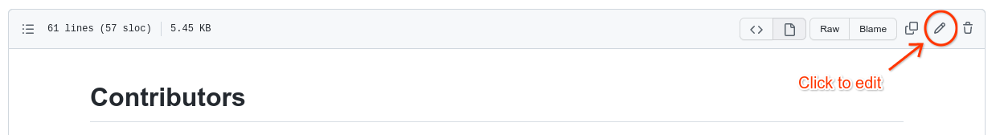
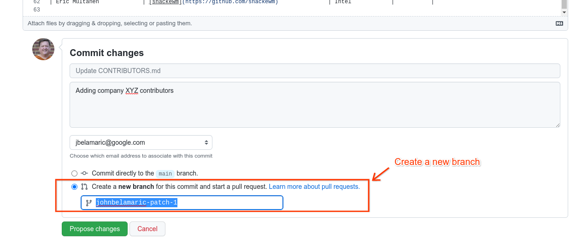
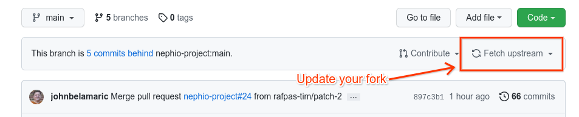

# Contributing to Nephio

Thank you for your interest in contributing to Nephio! Nephio is an open project
and welcomes all contributors.

# Contributors
A list of contributors, including the current Technical Steering Committee (TSC)
membership, is in [CONTRIBUTORS.md](CONTRIBUTORS.md).

In addition to the TSC, there are two types of contributors: 
 * *Contributors* include anyone in the technical community that contributes
   code, documentation, or other technical artifacts to Nephio.
 * *Committers* are Contributors that have earned the ability to merge pull
   requests in the Nephio GitHub repositories.

# How To Contribute

Contributors may submit pull requests to the Nephio repositories on GitHub. The
pull requests will be reviewed by at least one Committer who may decide to
accept or reject the pull request.

We are working on detailed guidance for contributors and will provide it here
when it is ready.

## Creating a Pull Request

We realize many new contributors may not be familiar with the GitHub workflow,
so we have provided a quick guide to using the GitHub UI to make small edits.
GitHub help has a more [complete guide](https://docs.github.com/en/pull-requests/collaborating-with-pull-requests/proposing-changes-to-your-work-with-pull-requests/about-pull-requests) that can be used when doing complex or multi-file edits.

A pull request is a request to add Git commits from a fork (duplicate) of a
repository back into the original repository.

To create and submit a simple pull request:

1. Fork this repository by clicking the 'Fork' button in the upper-right corner
   of the screen.

   
1. This will make a copy of the repository in your GitHub
   account.

   
1. In that copy, click on the file you wish to edit (for example,
   `CONTRIBUTORS.md`), then click the pencil icon to edit the file:

   
1. Edit the file, add a description of the change, choose the `Create a new
   branch` option, and click the `Propose changes` button.

   
1. In the next screen, click `compare across forks`, then change the `base
   repository` to `nephio-project/governance`. `base` should be `main`. This
   will create the pull request back to the original Nephio repository, rather
   than to your fork. Click `Create pull request`.

   
1. The next screen confirms the pull request creation. Be sure that `Allow edits
   by maintainers` is checked. This will allow us to resolve any conflicts
   without your intervention. Click `Create pull request`.

   
1. You should see your pull request in the Pull Requests list on the main
   nephio-project/governance repository. We will review this and merge it if
   approved.

   

## Updating your fork

After PRs have been merged into the original repository, your fork will become
out-of-date. This can cause conflicts if you make later edits to your fork that
you wish to merge back to the original repository.

Before making additional pull requests, go to your fork and update it to match
the original by clicking `Fetch upstream`:

