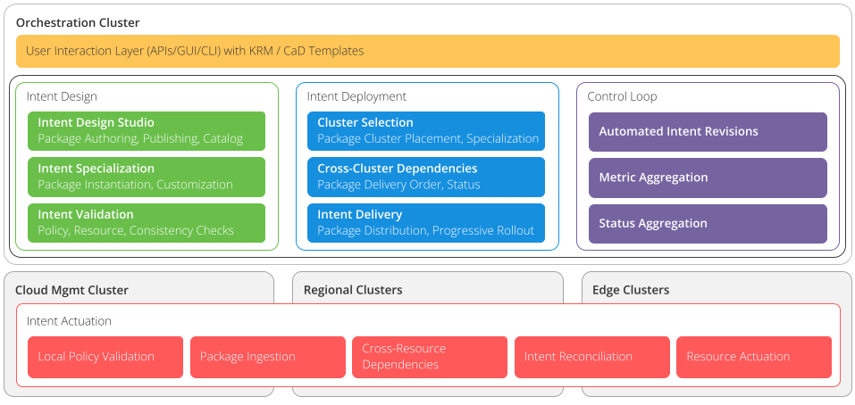

# SIG Automation

**Chair**: John Belamaric, Google, @johnbelamaric
**Vice-chair**: Wim Henderickx, Nokia, @henderiw

## Charter

As agreed to by the TSC and documented in the approved [Nephio Community
Document](https://docs.google.com/document/d/1agsjCN3aCjgPftO8AL4sCkv3Dp2ZRZ82-ikuVHAJTL8/edit?usp=sharing),
this SIG group focuses on design and standardization of schemas, CRDs, and operators; development of CRDs, Operators, related tooling & reference Implementation; and packaging and testing of functional components of Nephio.

## Subprojects

Recall the high-level functional components shown in the *Nephio Functional
Areas* figure.

The following subproject structure is defined in the terms of the figure, and
is intended to faciliate the delivery of R1. We will reconsider this structure
post-R1 for better longterm alignment with the community needs.

### Package Management
**Subproject Lead**: John Belamaric, @johnbelamaric

**Scope**:
- User Interaction Layer
- Intent Design
  - Intent Design
  - Intent Specialization
  - Intent Validation
- Intent Deployment
  - Cluster Selection
  - Cross-Cluster Dependencies

In terms of package lifecycle, this includes everything up to and including "fan
out", where the initial instances of per-cluster packages have been created and
have had basic variance injected by the PackageVariant controller. It does not
include additional per-cluster specialization done after fan out.

### Package Specialization
**Subproject Lead**: Wim Henderickx, @henderiw

**Scope**:
- Intent Design
  - Intent Validation (cluster specific)
- Intent Deployment
  - Cluster Selection / Specialization
  - Intent Delivery
- Control Loop
  - Automated Intent Revisions
  - Metric Aggregation
  - Status Aggregation

In terms of package lifecycle, this includes everything that happens in the
management cluster after fan out. Thus, it includes all coordinated injectors
and controllers that operate on package conditions, as well as any automated
controllers for validating, proposing, and approving cluster-specific packages.

### Workload Cluster
**Subproject Lead**: Tal Liron, @tliron

**Scope**:
- Intent Actuation
  - Local Policy Validation
  - Package Ingestion (git syncing)
  - Cross-Resource Dependencies
  - Intent Reconciliation
  - Resource Actuation

In terms of package lifecycle, this includes everything that happens after the
package is approved in the deployment repository.
