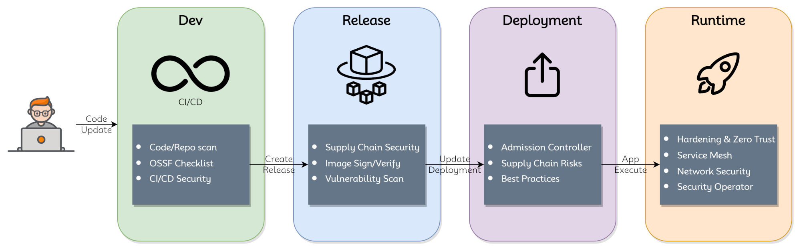

# SIG Security
**Chair**: TBA

**Vice-chair**: TBA

## Charter

As agreed to by the TSC and documented in the approved [Nephio Community Document](https://wiki.nephio.org/display/HOME/Nephio+Technical+Community+Document),
this SIG group focuses on security of code, images, deployment, and the runtime environment; development of CRDs, Operators, related tooling & reference Implementation; and packaging and security verification of components of Nephio.

## Community

Most activity is coordinated over the [#sig-security](https://nephio.slack.com/archives/C03MB5GRATS)(TBD) slack channel.

For details on meetings and links to other resources see the [SIG Security wiki page](https://wiki.nephio.org/display/HOME/SIG+Security)(TBD).

## Subprojects

Considerations for the SIG as a group:
* Security practices should not deter or cause friction in the release
  processes.  As far as possible the aim should be to fail the CI early in the
  lifecycle (for e.g., when the PR is raised) as opposed to when the release is
  triggered.
* Focus on security intent than on tooling. It should be possible to replace
  the tool, if needed, at a future date.
* The SIG should consider holistic security i.e., the scope should include
  securing all stages including dev, release, deploy, runtime.
* sig-security needs to work with other projects/sub-projects and ensure
  security goals are met across the nephio-project organization.

Opportunity for the SIG: **Differentiate Nephio as a "__Secure__ Telco Automation Framework".**

Following high-level security focus areas could be considered:

For each subproject, we list a lead and the scope of the subproject, as well as
the primary skills involved in participating in that subproject. As an open
community, we do not "require" any specific skills for contributors to
participate in the subproject. We hope to find ways for anyone to contribute,
and to build the necessary skills. However, it can be useful to list the primary
skills and areas of expertise involved in each group, to help people decide
where they may wish to participate.

### Code/Repo/Release security
**Subproject Lead**: TBA

**Scope**
- OSSF security practices
  - OSSF security score > 7
  - OSSF badges on prominent repos
- CI security practices to adopt for every subproject
  - Secrets/Key scanning
  - License scanning
  - Linting/Code smell scanning
- Supply Chain Security
  - Image Signing & verification
  - [Achieving SLSA L1->L2->L3 stages](https://slsa.dev/spec/v1.0/levels)

For every code repo in nephio-project github organization, it would be important to follow code/repo security scanning best practices. Depending on the development language used, the tooling might differ for individual repos. It would be better to use common github actions across all repos in the organization that would internally use appropriate secret tokens defined as part of github secrets.

This subproject will focus on:
- Continuously improving OSSF score
- Achieving SLSA levels and coordinating with individual projects to handle
  desired project changes
- Automating OSSF/SLSA/Code-scanning coverage using Github actions. Any new
  project/repo added should automatically import common github actions and
  should require setting up the CI actions infrastructure from scratch.
- Subproject should highlight security risks of individual projects

**Primary Skills**
- [GitHub Actions basics](https://docs.github.com/en/actions)
- [OpenSSF guidelines understanding](https://openssf.org/)
- Kubernetes Basics, [Kubernetes Resource Model](https://github.com/nephio-project/docs/blob/main/glossary.md#kubernetes-resource-model) (KRM)
- [CI/CD basics](https://www.redhat.com/en/topics/devops/what-is-ci-cd)
- [SLSA framework understanding](https://slsa.dev/get-started)

### Deployment Security
**Subproject Lead**: TBA

**Scope**
- Deployment best practices
  - No privileged containers
  - TLS best practices for k8s service endpoints
  - Mandatory resource request specification
  - Workload isolation requirements (certain workloads such as secrets manager may not share the nodes)
  - Helping projects handle the "Deployment security checklist"

**Primary Skills**
- [Understanding of k8s Admission controllers](https://kubernetes.io/docs/reference/access-authn-authz/admission-controllers/)
- Kubernetes Basics, [Kubernetes Resource Model](https://github.com/nephio-project/docs/blob/main/glossary.md#kubernetes-resource-model) (KRM)
- Kubernetes [CRD](https://github.com/nephio-project/docs/blob/main/glossary.md#custom-resource-definition) and
  [Controller](https://github.com/nephio-project/docs/blob/main/glossary.md#controller) Design
- [GitHub Actions basics](https://docs.github.com/en/actions)
- [CI/CD basics](https://www.redhat.com/en/topics/devops/what-is-ci-cd)

### Runtime Security
**Subproject Lead**: TBA

**Scope**
Once the workloads are deployed in the target environments, securing the workloads at runtime becomes crucial. Following runtime security use-cases needs to be taken into consideration:
- Network Security
- Workload hardening
- Service Mesh security (includes transport and API security)
- Secrets management

**Primary Skills**
- TBD

### K8s Security Operator
**Subproject Lead**: TBA

This group will study and propose how a k8s security operator could improve and maintain the security posture of the target depoyment.
The scope includes:
- Defining the intent spec for security operator
- Defining a high level architecture and call flow for sample use-cases
- Defining how the tooling will be loosely coupled with the security intent

**Primary Skills**
- Golang dev
- k8s controller/operator dev
- Design/Architecture

### Ensuring Zero Trust Security for Nephio
**Subproject Lead**: TBA

This group will study and propose how the Nephio components can achieve Zero Trust security and subsequently the full lifecycle to maintain the Zero Trust security posture.
The scope includes:
- Defining the security dimensions to consider for Zero Trust
- Defining tooling to be used in the context
- Defining how the zero trust security posture would be retained across platform and workload code/config updates

**Primary Skills**
- Security background with understanding of deploying zero trust based security elements
- k8s controller/operator dev
- Design/Architecture

